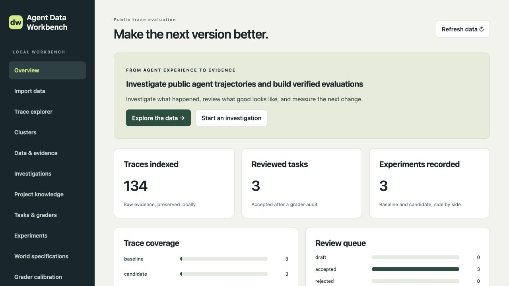
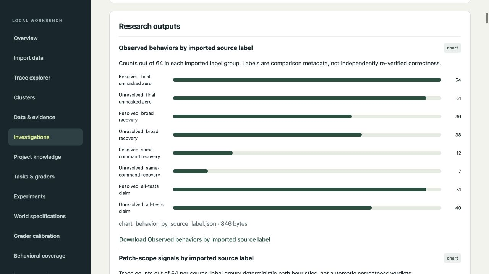
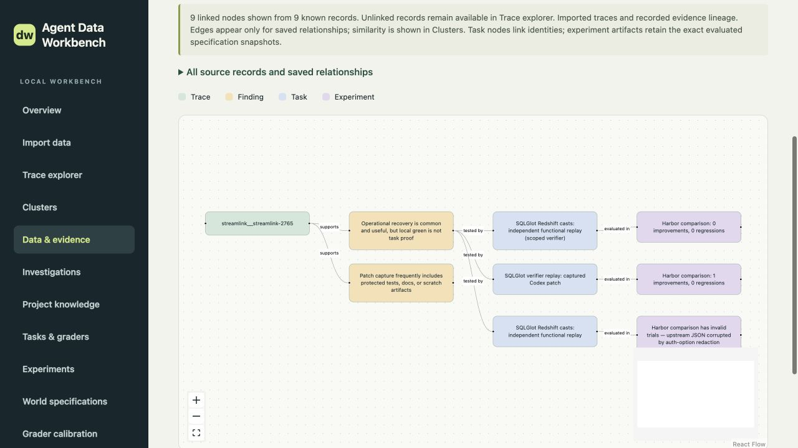
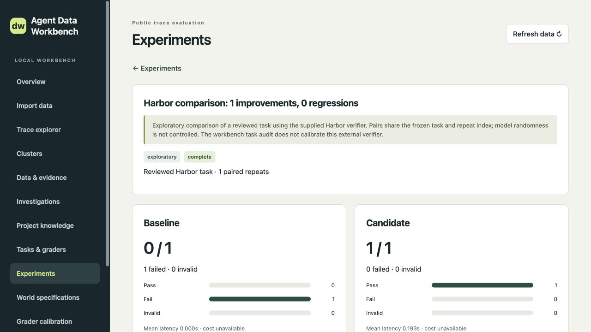

<div align="center">

# Agent Data Workbench

**Turn agent traces into findings, evals, and improvement experiments.**

A local workbench for developers building coding agents, chat agents, and other agent systems.

[](pyproject.toml) [](LICENSE)

[Quickstart](#quickstart) · [Bring your data](#bring-your-data) · [Research](#investigate-what-to-improve) · [Harbor](#test-a-change-with-harbor) · [Contribute](#contribute) · [OpenWiki](openwiki/index.md)

</div>



_Real app screenshots from a local workspace using [public SWE-rebench / OpenHands trajectories](https://huggingface.co/datasets/nebius/SWE-rebench-openhands-trajectories) and subsequent Harbor trials. Counts describe that workspace, not the entire upstream dataset._

Your agents produce conversations, tool calls, failed attempts, and successful recoveries. Agent Data Workbench helps you turn that history into two useful outputs:

- **Understanding:** searchable traces, findings with source evidence, charts, and reports.
- **Evaluation data:** reviewed tasks, graders, baseline/candidate comparisons, and curated training exports.

Research the data yourself or bring in **Codex or Claude Code**. The CLI, Python SDK, and TypeScript UI share the same local project.

## Quickstart

### Use your existing Codex or Claude Code login

You need **Git, Make, [uv](https://docs.astral.sh/uv/getting-started/installation/), and Node.js 24.15+** on the supported 24.x release line. On Windows, use WSL2. Install and sign in to the agent CLI you want to use in the same environment as the backend. Docker is needed when running Harbor's Docker environments.

```sh
git clone https://github.com/shekharpalit/agent-data-workbench.git
cd agent-data-workbench
make init MODE=native
make dev MODE=native
```

`make init` builds the UI, installs the locked Python dependencies and Harbor, and creates `runs/workbench`. uv uses the repository's pinned Python version. Keep uv's tool executable directory on your `PATH` so the backend can find Harbor.

**Open the complete private URL printed in the terminal.** The app starts at `127.0.0.1:8765`; the printed URL includes your session token. Keep the terminal running. Use `PORT=9000` if the default port is busy.

In a second terminal, from the repository directory:

```sh
uv run agent-data-workbench ingest runs/workbench ./traces
```

Replace `./traces` with your export directory, then refresh the UI. **No traces yet?** Use the public dataset workflow below.

<details>
<summary><strong>Prefer Docker? Start here for importing data and manual research.</strong></summary>

Install Docker with Compose v2 and Make, clone the repository, then run:

```sh
make init
make dev
```

Open the private URL printed by the backend. From another terminal:

```sh
make ingest DIR=./traces
```

The stock image includes the workbench. Native agent investigations additionally need an installed, authenticated agent CLI in the backend environment; host CLI logins are not inherited. Use native mode above for that workflow and for host Harbor execution.

Project data persists in a Docker volume. `make down` stops containers and keeps the data; `make up` starts the packaged app in the background. `make dev PORT=9000` changes the port. Native mode and Docker use separate project storage by default.

</details>

## Bring your data

### A folder of agent runs

```text
traces/
├── run-001.jsonl
├── run-002.jsonl
└── another-batch/
    └── run-003.jsonl
```

```sh
# Recursively import all supported run files together.
uv run agent-data-workbench ingest runs/workbench ./traces

# Or select multiple files explicitly.
uv run agent-data-workbench ingest runs/workbench ./run-a.jsonl ./run-b.jsonl

# If each line is already a complete trace, choose the records layout.
uv run agent-data-workbench ingest runs/workbench ./export.jsonl --layout records
```

By default, **one JSONL file is one trace**, and each nonblank line must be a JSON object. Events stay in order with their original fields and content. JSON and NDJSON files are also supported. A failed batch rolls back its records; importing identical data again reports it as unchanged.

You do not need to instrument your agent with this SDK first. Import JSON exports from your existing system. The generic parser preserves the data; choose fields that match your schema for grouping, categories, outcomes, and clustering. Framework-specific meaning still needs the right context. See [trace formats and field mappings](openwiki/workflows/traces.md) for custom exports.

### A public Hugging Face dataset

From the UI:

1. Open **Import data → Use SWE-rebench / OpenHands preset**.
2. Enter **32** in **Maximum rows** for a small first import, or leave it blank for the whole split.
3. Click **Inspect source & schema**, check the revision and field mappings, then **Import dataset**.
4. Open **Data & evidence** for source-provided outcomes and repeated attempts. Open **Trace explorer** to read the full conversations.

The preset maps each trajectory to its issue and repository. Imports record the resolved source revision and preserve complete selected rows. The optional row count selects records; it does not shorten their messages.

<details>
<summary>Equivalent Hugging Face CLI command</summary>

```sh
uv run agent-data-workbench ingest-hf runs/workbench \
  nebius/SWE-rebench-openhands-trajectories \
  --split train \
  --id-pointer /trajectory_id \
  --group-pointer /instance_id \
  --stratum-pointer /repo \
  --limit 32
```

Omit `--limit` to import the entire split. Use `--revision` to request a specific source revision.

</details>

## Investigate what to improve

Start with a question you can act on: **“Which failures recur, what evidence explains them, and what should we test next?”** Add relevant policies, tool contracts, and expected behavior in **Project knowledge** so the investigator can judge your agent against its actual task.

In **Investigations**, choose how to work:

| Research yourself                                                          | Use an agent                                                                                           |
| -------------------------------------------------------------------------- | ------------------------------------------------------------------------------------------------------ |
| Choose **Research myself → Start manual research**.                        | Choose **Use an agent**, select Codex or Claude Code, and check the displayed CLI/login status.        |
| Inspect records, save outcomes and notes, and publish findings and charts. | Choose a model and, for Codex, a supported reasoning effort, then click **Investigate**.               |
| No model or provider account needed.                                       | The native agent can query the captured dataset, write analysis code, and save evidence and artifacts. |

The selected CLI uses its own authentication and account limits; agent research sends the context it uses through that provider.

Both use a saved dataset snapshot. You can bring an agent into a manual investigation later. **Research** mode supports exploration; **complete** mode requires an outcome for every supplied record. Record coverage is tracked separately from what the researcher has actually established.



_Research outputs include charts and downloadable artifacts. Source labels are comparison metadata; findings need evidence from the original traces._

<details>
<summary>Run or resume research from the CLI</summary>

```sh
uv run agent-data-workbench investigate runs/workbench \
  --backend codex \
  --question "Which recurring failures should we turn into regression tests?"
```

Use `--backend claude` for Claude Code, `--model` to select an available model, and `--reasoning-effort` for supported Codex effort settings. Add `--mode complete` to require outcomes for every record. Continue saved work with `--resume <investigation UUID>`.

The selected CLI's authentication, model availability, and account limits apply. Ingestion and local exploration make no model calls. Agent research sends the context it uses through your selected provider.

</details>

## Follow the evidence into evals

Open a completed investigation and use **Design tasks** to propose evaluation tasks. In **Tasks & graders**, review the behavior being tested, inspect the specification and grading examples, run **Run deterministic audit**, and record your decision with **Accept task**. Resolve missing context and failing checks before acceptance. Semantic grading criteria additionally need a judge configured through the CLI; see [tasks and graders](openwiki/workflows/tasks-and-graders.md).

Use **Clusters** to find shared language worth investigating. Use **Data & evidence → Evidence lineage** to see saved links from a trace to findings, tasks, and experiments. Focus on one trace, fit the graph to the canvas, and select a node to open its source artifact.



_Every edge represents a saved relationship. Text similarity is explored separately in Clusters._

## Test a change with Harbor

The workbench manages the research, reviewed task, and comparison record. **[Harbor](https://harborframework.com/) runs the actual agent in your task environment and invokes its verifier.** You supply the runnable environment and tests for the behavior you want to measure.

Use native mode, have Docker running, and prepare a Harbor task template accessible to the backend. The exporter expects `schema_version = "1.4"` in `task.toml`:

```text
my-harbor-task/
├── task.toml
├── environment/
│   └── Dockerfile
└── tests/
    └── test.sh
```

Then, from an accepted task:

1. Open **Run a Harbor comparison** and check the Harbor/Docker runtime status.
2. Enter your template directory and the baseline and candidate agent/model configurations. Use Harbor's built-in agents or an installed `package:AgentClass` adapter for your own agent.
3. Set paired repetitions, the verifier reward key, and the passing threshold, then click **Run baseline & candidate**.
4. Open **Experiments** to compare passes, failures, and invalid runs. Inspect a trial's verifier evidence and follow **Inspect generated trace** to its available trajectory.

Harbor targets need their own credential setup in the execution environment. For a Codex target, **Use host Codex login** explicitly enables the backend user's existing login inside the task container.



_This screenshot shows a no-op baseline against a replay of a captured patch. It demonstrates the comparison workflow, not a model performance gain. Review the external verifier independently: the workbench's grader audit does not validate Harbor's test script._

See the [Harbor integration guide](openwiki/integrations/harbor.md) for template requirements, CLI configuration, exports, and result semantics. For broader evaluation work, the workbench also supports grader calibration, behavioral coverage, dataset splits, and [training exports](openwiki/workflows/experiments-and-training.md). Training runs happen in your own training stack.

## Use the Python SDK

The UI and CLI call the same Python packages. From an installed checkout:

```python
from pathlib import Path

from agent_data_workbench import FilesSource, Project, TraceStore

project = Project.create(
    Path("runs/my-agent"),
    "My agent",
    "Improve reliable task completion",
)
store = TraceStore(project)
print(store.ingest(FilesSource(["./traces"])))
print(store.select(text="error", limit=20))
```

Use a new directory with `Project.create`; use `Project(Path("runs/my-agent"))` to reopen it. Adapters can implement `TraceSource.read()` to supply `Trace` objects from other systems. The SDK also exposes investigation, task, experiment, and Harbor operations.

## Contribute

Good places to help: trace-format adapters, clearer evidence visualization, task/verifier integrations, and reproducible ingestion or evaluation bugs. [Open an issue](https://github.com/shekharpalit/agent-data-workbench/issues) with the expected behavior and a small synthetic reproduction, or send a focused PR. Keep customer traces and credentials out of contributions.

After native setup, run the checks relevant to your change:

```sh
uv run pytest -q
uv run ruff check src tests
uv run ruff format --check src tests
npm --prefix ui test
npm --prefix ui run format:check
npm --prefix ui run build
```

Write tests in **Given / When / Then** form and compare complete result objects. The backend uses Python, FastAPI, and SQLAlchemy; the UI uses React and TypeScript. Read [AGENTS.md](AGENTS.md) or [CLAUDE.md](CLAUDE.md) before changing the code.

| Looking for more detail?            | Start here                                                                                                               |
| ----------------------------------- | ------------------------------------------------------------------------------------------------------------------------ |
| Architecture and package boundaries | [System architecture](openwiki/architecture/system.md)                                                                   |
| Runtime, storage, and Docker        | [Local operation](openwiki/operations/local-workbench.md) · [Containers](openwiki/operations/containers.md)              |
| Research and evaluation contracts   | [Investigations](openwiki/workflows/investigations.md) · [Tasks and graders](openwiki/workflows/tasks-and-graders.md)    |
| Development and documentation       | [Contributor guide](openwiki/development/contributing.md) · [OpenWiki maintenance](openwiki/operations/documentation.md) |

OpenWiki provides the deeper reference. To explore it locally, install OpenWiki 0.5.0 and run `openwiki visualize openwiki`.

Released under the [MIT License](LICENSE).
