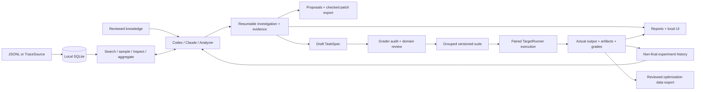

# Workbench architecture

## Extension points

`TraceSource.read() -> Iterable[Trace]` preserves source records. Adapters should attach stable run IDs, conversation/episode grouping, model/harness versions, tool observations and outcome feedback. JSON Schema and JSON pointers are the interchange boundary.

`Analyzer.name` and `Analyzer.analyze(prompt, schema) -> dict` implement structured analysis. Native adapters receive explicitly constructed text and schemas. Each investigation turn uses a fresh invocation and persisted journal. The host validates the requested read action, executes it and validates final citations. Research does not execute model-written code or apply proposals.

`TargetRunner.identity() -> dict` identifies the target and reproducibility inputs. `run(visible_input, trial_dir, seed) -> Execution` executes it. Implementers own fixture reset, dependency pinning, actual tool access, external state isolation and seed support. Command runners use an argv list and JSON stdin/stdout, with named JSON artifacts captured from the trial directory. A container, Harbor or application harness can implement this interface; none is implicitly supplied.

`Criterion` supports deterministic output/artifact assertions and evidence-checked semantic rubrics. Semantic audits and experiments must use the same recorded judge/model configuration. Quote validation establishes evidence existence, not judgment correctness. Audit examples and domain review should block incorrect graders.

`TaskSpec` contains visible input, host-side criteria, audit examples, assumptions, missing context and source lineage. Replay creates only a conversation prefix; traces cannot recover absent state. Editing resets review and audit while retaining the old revision.

## Boundaries

The CLI and loopback UI call shared project functions. HTTP data reads require a session token; all POST requests also require the same origin. Static assets contain no project data. React renders external content as text, never dynamic HTML. The UI does not execute arbitrary target commands; configure those through the CLI or SDK.

Research excludes final source groups after suite creation; prior exposure is recorded rather than erased. Local files and host-accessible runners do not provide adversarial holdout secrecy. Production extensions should isolate hidden evaluation state and retain fresh episodes independently of optimization.

The project lock serializes mutations. JSON replacement is atomic. Resume verifies corpus/context fingerprints. Execution verifies frozen task hashes, reviews, audits and declared source files. Runner failures or absent artifacts produce invalid observations; behavior failures and regressions stay visible.

The improvement loop is explicit: investigate, review a proposal, configure a candidate, run a suite, inspect all outcomes. There is no automatic patch application or unbounded optimizer. Training export supplies curated records, not a post-training service.

## Storage tradeoffs

`database.py` defines SQLAlchemy 2's typed `TraceRow` mapping. `TraceStore` owns SQLAlchemy sessions and expression-based queries; `explore.py` consumes its row iterator. Every operation gets a separate session, so API worker threads never share session state. Imports commit as a batch or roll back completely. SQLite uses explicit transaction control and closes connections after each operation through `NullPool`.

The database stays at `<project>/traces.sqlite3`, with the existing six columns and group/stratum indexes. Canonical JSON remains TEXT to preserve fingerprints and previously imported records. Existing projects require no reimport or schema rewrite. Schema creation uses SQLAlchemy metadata; future schema changes will need explicit versioned migrations. Corpus scans fetch rows in batches of 100 through SQLAlchemy rather than buffering all trace bodies in its result layer.

SQLite avoids putting complete exports into model context. Search/aggregates remain scans; inventory and balanced sampling retain metadata in memory. Evidence snapshots and experiment JSON are bounded by the 50 MiB artifact reader. Large production datasets need pushdown filtering, incremental fingerprints, paginated artifact summaries and streamed trial storage before increasing scale claims.

## TypeScript workbench

`ui/src` owns application logic, typed API contracts, query state and React components. TanStack Query handles request state and cancellation, with automatic retries disabled. Vite compiles into `src/agent_data_workbench/web`; `server.py` launches Uvicorn on a loopback socket. `api.py` registers explicit FastAPI routes and mounts the compiled assets with `StaticFiles` on the same origin. React Flow is loaded when the evidence graph opens. `index.html` is only the bootstrap document.

`explore.py` implements typed search, filtered distributions, lexical clustering and recorded lineage. Search retains only enough sorted rows for the requested page; matching still scans SQLite. Distributions cover every matching record regardless of pagination and expose missing values. Clustering caps both the number of traces (200) and extracted text per trace (20,000 characters), reports clipping and missing text, and uses TF-IDF cosine connected components. Transitive members need not meet the threshold pairwise. It does not call an embedding service or infer semantic categories. Graphs cap visible nodes (200 by default), retain only edges between displayed nodes and can follow one trace downstream. Experiment artifacts preserve the actual evaluated specification snapshots.

Reports are a separate output channel. There is no `report.py`: reporting functions in `workflow.py`, `research.py` and `experiments.py` write portable Markdown for CLI users, CI artifacts and human sharing. The TypeScript UI consumes structured JSON directly and never parses those reports.

## FastAPI transport

`create_app(project, origin=..., token=...)` creates an isolated application per local project session. FastAPI validates request bodies and query parameters against the Pydantic contracts in `api_models.py` and `explore.py`; handlers call the existing SDK. Synchronous SDK operations run through the framework's thread pool. `JobQueue` keeps explicit model jobs separate from HTTP requests and admits only one at a time. Rejected concurrent investigations create no new artifacts.

The existing API URLs and error envelope are preserved. Validation errors return HTTP 400 with `{"error": "Invalid structured data; check required fields"}`; request values are omitted. Authenticated clients can retrieve generated OpenAPI at `/api/openapi.json`. Interactive documentation is disabled because this workbench ships all UI assets locally.

`local_http.py` contains only session and transport boundaries: the exact loopback Host, bearer token, same-origin POST requests, 2 MB request cap and response headers. The body cap counts received bytes, including bodies without Content-Length. Routing, JSON parsing and static file resolution belong to FastAPI and Starlette. `server.py` holds the listening socket while Uvicorn starts so port selection has no bind/rebind gap, disables proxy-header trust and access logs, and preserves the printed private URL and Ctrl-C shutdown workflow.

The CLI opens the browser only after Uvicorn is ready to serve requests. Developers launch the backend and bundled UI together with `agent-data-workbench ui <project> --open-browser`; there is no separate server startup command to manage.

API contracts are exercised with FastAPI's TestClient; existing loopback HTTP tests exercise Uvicorn as well. Tests use Given–When–Then and complete object comparisons.
