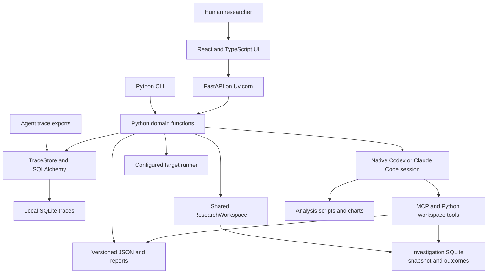

# System architecture

Agent Data Workbench is a local Python application with a bundled React/TypeScript interface. The CLI and HTTP API call the same SDK functions; the browser supplies interaction and visualization. A project directory holds the evidence and derived artifacts.

## Responsibilities

All Python paths below are relative to `src/agent_data_workbench/`. The package root contains only the public SDK exports and module CLI entrypoint.

| Package | Owns | Where to start |
| --- | --- | --- |
| `data/` | File discovery, run/record ingestion, source contracts and SQLAlchemy trace storage | `discovery.py`, `ingestion.py`, `sources.py`, `store.py` |
| `analysis/` | Batch findings, evidence validation, prompts, reports and analyzer benchmarks | `contracts.py`, `validation.py`, `batch.py` |
| `research/` | Human/native investigation snapshots, outcomes, sessions and MCP tools | `workspace.py`, `dataset.py`, `sessions.py` |
| `evaluation/` | Tasks, grading, suites, paired experiments, worlds, calibration and improvement decisions | `tasks/`, `suites.py`, `experiments.py` |
| `execution/` | Target contracts, persistent sessions, user simulators, environments and artifact capture | `contracts.py`, `sessions.py`, `environments.py`, `runners.py` |
| `exploration/` | Typed search, distributions, lexical clusters and evidence lineage | `schemas.py`, `search.py`, `clustering/`, `lineage.py` |
| `integrations/` | Native CLI analyzer adapters, Harbor and training exports | `analyzers.py`, `harbor.py`, `training.py` |
| `workspace/` | Project configuration, artifact directories, reviewed knowledge and locks | `project.py` |
| `shared/` | Domain-independent JSON/pointers/equality, UUIDs, persistence, Markdown and process helpers | `json.py`, `files.py`, `identifiers.py`, `processes.py` |
| `workbench/` | Application startup, listener/session lifecycle and background jobs | `runtime.py`, `server.py`, `jobs.py` |
| `api/`, `cli/` | Typed HTTP and command entrypoints calling domain operations | `api/application.py`, `api/routers/`, `cli/__init__.py` |

The React/TypeScript UI remains in `ui/`; the packaged browser assets remain in `web/`. Domain modules import shared infrastructure. Shared infrastructure does not import domain packages. Task contracts, persistence/review, grading, authoring and replay have separate modules inside `evaluation/tasks/`; moving a file should not mix these responsibilities again.

Public imports such as `from agent_data_workbench import Project, FilesSource, TraceStore` remain available. Code importing former internal flat modules must use the owning domain path. The CLI names, HTTP routes and persisted project format are unchanged by this reorganization.

The app factory composes domain routers. FastAPI dependencies supply the project, job queue, and bearer authentication; request middleware enforces host, origin, and body limits. `workbench/server.py` starts Uvicorn and owns the local session lifecycle.

The service layer translates requests into SDK operations. It does not contain a separate copy of task acceptance or research logic. FastAPI's interactive documentation routes are disabled; the session-protected `/api/openapi.json` describes the implemented API.

## Local state and consistency

`Project.create` requires a new or empty directory. It writes `project.json` and creates `knowledge/`, `investigations/`, `tasks/`, `suites/`, `experiments/`, `exports/`, `worlds/`, `improvements/`, `calibrations/`, `taxonomies/`, and `coverage/`. A project-local `.gitignore` excludes its contents. Use a directory under `runs/` for private working data.

`TraceStore` uses `traces.sqlite3`. SQLAlchemy maps the original six-column trace layout: ID, source group, stratum, canonical JSON, content hash, and import time. A session transaction wraps each operation; an import conflict rolls back its batch. The engine uses `NullPool`, and first-use schema creation is serialized inside the process. Worker threads obtain their own sessions.

Internal artifact IDs are canonical UUID strings validated with Python UUID/Pydantic types. Generated records use UUIDv4; content-derived identities use UUIDv5. Imported trace IDs remain unchanged. Suite names are friendly labels separate from their UUIDs. Project format 0.3 rejects older project formats before rewriting any files; create a new project and reimport the traces.

Structured artifacts are written through `shared.files.atomic_text`; Markdown escaping is shared through `shared.markdown.md`. Mutating workflows use a nonblocking POSIX project lock; a concurrent mutation returns a busy error. The HTTP job queue separately permits one background model job at a time. These mechanisms serve a local process-and-files workflow, not a distributed job system.

## Shared human and agent research workspace

Manual UI research creates a snapshot through the same SDK without invoking a native CLI or background model job. The browser can search and read that investigation snapshot, record typed outcomes, checkpoint notes, publish findings and create charts. It uses the same evidence and complete-pass rules as native research. Human creation does not introduce a different project format or a separate dataset owner.

The manual HTTP mutation routes acquire the same nonblocking session lock as native research. This prevents a stale browser tab from publishing final findings or changing outcomes underneath a running native session. The native session's own SDK and MCP tools remain available while it owns that lock. Pausing the native session returns manual write access; the UI keeps unsaved findings, note and chart forms mounted but hidden and disabled during active sessions.

`research/sessions.py` launches one native Codex or Claude Code session per invocation. The native agent owns planning, tools, code execution, context management, and session continuation. The workbench supplies `ResearchWorkspace`, exposed through Python, the CLI, and the official MCP SDK. It does not drive another model-call loop. Existing `Analyzer` integrations remain available for batch analysis, task design and semantic judging.

Each investigation captures all selected inputs into its own SQLAlchemy-backed `dataset.sqlite3`, alongside frozen context, workspace instructions, scripts and outputs. New imports or knowledge changes do not invalidate this snapshot. All imported records are included by default; excluding reserved final groups is explicit and exposure is recorded conservatively.

Research mode lets the agent explore adaptively. Complete mode requires a saved successful outcome for every record before final publication. Iterators read pages without limiting total coverage; processing checkpoints each outcome and resumes pending or failed records. Coverage records work performed through the SDK, not proof of semantic review or model quality. Native session IDs, attempt logs and journal entries preserve progress; process termination releases the separate session lock. Project locks are held for short artifact mutations, not throughout the native session.

## How evidence becomes an experiment

Import preserves source records. An [investigation](../workflows/investigations.md) researches them and cites exact evidence. [Tasks](../workflows/tasks-and-graders.md) separate target-visible input from grading criteria and require review after a grader audit. A suite freezes accepted task specifications and source-group assignments. [Experiments](../workflows/experiments-and-training.md) execute two target variants and preserve trial output, required artifacts, invalid runs, and regressions. Training export selects reviewed outcomes from optimization experiments.

These records provide provenance and detect accidental drift. They do not isolate a hostile target from host files or establish that a synthetic result generalizes to production.

## Extension seams

Implement `TraceSource.read()` to import another export format, `Analyzer.analyze(prompt, schema)` for another batch/judge backend, or `TargetRunner.identity()` and `run(visible_input, trial_dir, seed)` for another execution harness. Native research can also use the shared `ResearchWorkspace` directly from an existing coding-agent session or a custom `NativeSession` adapter. `EnvironmentRunner` supplies a setup/reset/readiness/observer/teardown lifecycle, while `ConversationRunner` owns one continuous command target session. Each reviewed task supplies its scenario; experiments record the effective runner identity. The optional Harbor adapter exports a supplied real template and invokes the installed Harbor CLI. Direct service connectors, distributed workbench execution, and training-job execution remain extension work. See [eval engineering](../workflows/eval-engineering.md).

Next: [import and explore traces](../workflows/traces.md), [run the local workbench](../operations/local-workbench.md), or [development](../development/contributing.md).

## Versioned improvement evidence

Accepted world lineage heads feed research context; a task can explicitly pin an older accepted world by UUID and digest. Independent state assertions read only observer-owned evidence, separately from target artifacts. Experiment records retain world/task snapshots, effective runner identities, chronological conversation evidence, and copied trial files.

Calibration freezes actual attempt evidence and records reviewer labels and adjudication. Behavioral coverage maps exact trace/task versions to reviewed capabilities and slices; it does not reuse research-completion counts as coverage. Improvement records capture source snapshots and a patch, require exact baseline/candidate identities when linked to experiments, and retain explicit keep/reject/inconclusive decisions with available calibration summaries. A decision does not apply or deploy code.

## Container process and storage ownership

The root Makefile drives Docker Compose. Development runs a FastAPI/Uvicorn backend and a separate TypeScript build watcher. The watcher writes a shared asset volume that FastAPI serves on the same browser origin; it does not expose a second UI server. Compose waits for the UI assets to be readable before starting the backend. The packaged app instead installs a wheel containing the production bundle and runs one Python service. See [Docker and Make workflow](../operations/containers.md).

The development image contains Python, Node and locked development dependencies. The runtime image uses the production Python environment. Both run as the workbench user. A named volume holds `/data/project` independently from source mounts and container lifetime. Python dependencies remain under `/opt/venv`; UI dependencies have their own named volume.

`workbench/runtime.py` creates an empty project once or opens the existing project, then starts Uvicorn. Development reload uses an import-string factory and inherits the same bearer token across child restarts. The externally visible origin is configured separately from the container bind address. Compose binds Python to `0.0.0.0` inside the container and publishes only the host loopback address. Native agent CLI processes still need installation and authentication in the environment hosting the backend.
