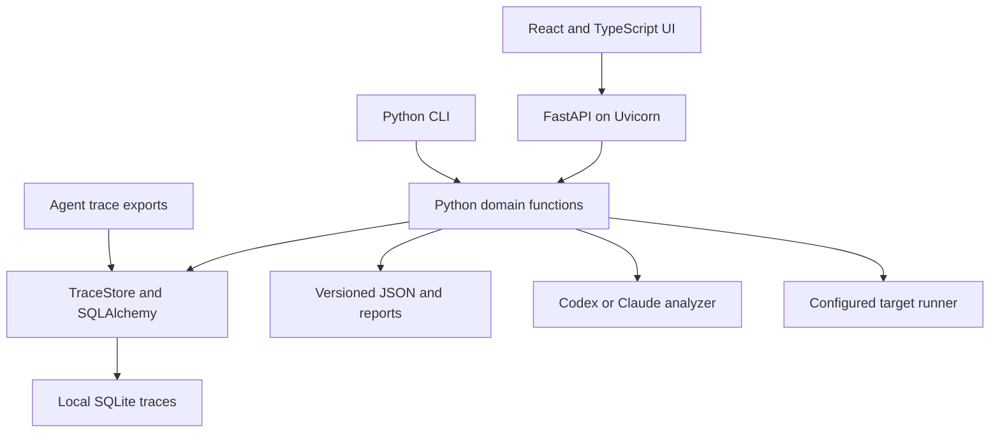

# System architecture

Agent Data Workbench is a local Python application with a bundled React/TypeScript interface. The CLI and HTTP API call the same SDK functions; the browser supplies interaction and visualization. A project directory holds the evidence and derived artifacts.

## Responsibilities

| Component | Responsibility | Main entry points |
| --- | --- | --- |
| CLI | Import, research, task review, experiments, and export commands | `cli.py`, `commands.py` |
| SDK | Domain contracts and the improvement workflow | `__init__.py`, `research.py`, `tasks.py`, `experiments.py` |
| Storage | Canonical trace records and query primitives | `store.py`, `database.py` |
| Local HTTP | Typed operations, session boundaries, static assets, background jobs | `api.py`, `api_models.py`, `local_http.py`, `jobs.py` |
| UI | Trace search, clusters, lineage, reviews, and experiment inspection | `ui/src/App.tsx`, `ui/src/views/` |
| Extensions | Bring another trace source, analyzer, or target harness | `TraceSource`, `Analyzer`, `TargetRunner` |

The service layer translates requests into SDK operations. It does not contain a separate copy of task acceptance or research logic. FastAPI's interactive documentation routes are disabled; the session-protected `/api/openapi.json` describes the implemented API.

## Local state and consistency

`Project.create` requires a new or empty directory. It writes `project.json` and creates `knowledge/`, `investigations/`, `tasks/`, `suites/`, `experiments/`, and `exports/`. A project-local `.gitignore` excludes its contents. Use a directory under `runs/` for private working data.

`TraceStore` uses `traces.sqlite3`. SQLAlchemy maps the original six-column trace layout: ID, source group, stratum, canonical JSON, content hash, and import time. A session transaction wraps each operation; an import conflict rolls back its batch. The engine uses `NullPool`, and first-use schema creation is serialized inside the process. Worker threads obtain their own sessions.

Structured artifacts are written through an atomic-text helper. Mutating workflows use a nonblocking POSIX project lock; a concurrent mutation returns a busy error. The HTTP job queue separately permits one background model job at a time. These mechanisms serve a local process-and-files workflow, not a distributed job system.

## How evidence becomes an experiment

Import preserves source records. An [investigation](../workflows/investigations.md) researches them and cites exact evidence. [Tasks](../workflows/tasks-and-graders.md) separate target-visible input from grading criteria and require review after a grader audit. A suite freezes accepted task specifications and source-group assignments. [Experiments](../workflows/experiments-and-training.md) execute two target variants and preserve trial output, required artifacts, invalid runs, and regressions. Training export selects reviewed outcomes from optimization experiments.

These records provide provenance and detect accidental drift. They do not isolate a hostile target from host files or establish that a synthetic result generalizes to production.

## Extension seams

Implement `TraceSource.read()` to import another export format, `Analyzer.analyze(prompt, schema)` for another analysis backend, or `TargetRunner.identity()` and `run(visible_input, trial_dir, seed)` for another execution harness. Keep real environment reset and authoritative state capture inside the runner integration. Direct service connectors, Harbor integration, distributed execution, and training-job execution are not bundled.

Next: [import and explore traces](../workflows/traces.md), [run the local workbench](../operations/local-workbench.md), or [development](../development/contributing.md).
