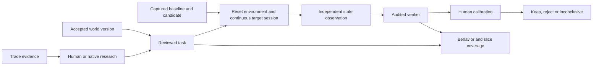

# Worlds, environments and continuous evaluation

The workbench connects a trace failure to a reviewed task, an actual target run and a human improvement decision. Use the [local UI](../operations/local-workbench.md), the Python SDK, or `agent-data-workbench workflow`. Native Codex/Claude research continues to own analysis and context management; target evaluation uses its own explicitly configured harness.



Implementation ownership follows this flow: `evaluation/` owns reviewed worlds, grading, calibration, coverage and decisions; `execution/` owns the environment and live target session; `integrations/harbor/` owns the optional Harbor adapter. Session/environment/runner schemas are collected in `execution/contracts.py`, and process I/O is separated from conversation orchestration. See the [package map](../architecture/system.md#responsibilities) for extension points.

## Reuse domain knowledge without leaking task answers

A `WorldSpec` contains name, domain, description, sources, named JSON schemas, tool input/output schemas, relationships, permissions, success invariants and unresolved questions. Creating a successor uses a new UUID and `previous_id`; specifications are immutable, while review history records reviewer, reason and content digest. Acceptance requires unresolved questions to be resolved in a new version.

Accepted lineage heads enter project research context. Earlier accepted versions remain addressable by a task's `world: {id, sha256}`. A task can therefore reproduce its historical rules without injecting competing old/new rules into current research. Branching world lineages can have multiple accepted heads. Reviewing knowledge does not automatically enforce a permission in the service: implement domain constraints in your environment and verify them through state.

```sh
agent-data-workbench workflow world PROJECT world.json
agent-data-workbench workflow world-review PROJECT WORLD_ID accepted "Checked domain contracts" "Reviewer"
```

Keep the user request and allowed fixtures in `TaskSpec.input_json`. World metadata, criteria, audit fixtures and hidden success definitions are not automatically sent to the target. The task also defines its `environment` and `conversation`; [task review](tasks-and-graders.md) freezes those fields with the verifier.

## Reproduce and inspect the environment

`EnvironmentConfig` requires a name, version, authority description and explicit argv lists for `setup`, `reset`, `ready` and `inspect`. Optional fields are teardown argv, additional source files, declared dependency versions, expected initial-state digest and developer-selected timeout. Commands run on the trusted local host. This lifecycle is an integration contract, not container isolation or an automatic service simulator. With the [Docker workbench launcher](../operations/containers.md), local execution occurs inside the workbench container; make integration commands and their data available in that environment.

Each phase receives one JSON object on stdin:

```json
{
  "phase": "inspect",
  "moment": "initial",
  "seed": 0,
  "trial_dir": "/local/trial",
  "state_dir": "/local/observer-workspace",
  "input": {}
}
```

The paths and seed are supplied by the runtime; `moment` is initial/final for inspection and null for other phases. Commands emit one JSON object:

| Phase | Required behavior/output |
| --- | --- |
| setup | Start/materialize the environment; optionally return `{"target_context": {...}}` |
| reset | Restore the reviewed fixture state; return `{"reset": true}` |
| ready | Check service availability; return `{"ready": true}` |
| inspect | Read authoritative service/store state; return `{"artifacts": {"state.json": {...}}}` |
| teardown | Release resources when configured; return a JSON object |

Setup context reaches the target under reserved `environment_context`. Each trial executes setup → reset → readiness → initial inspection → target → final inspection → teardown. An optional `initial_state_sha256` rejects reset drift before target execution. Runtime commands and directly referenced files are fingerprinted; dependency-version strings remain developer declarations.

A criterion with `source: "state"` reads the observer map through its `artifact` key. It never reconstructs state from target-written files or a target's claimed usage. Ordinary `source: "artifact"` retains captured target-file semantics. Whole-object `equals` assertions can verify expected changes and unchanged collateral fields together.

The observer's authority depends on the configured service integration. A target can write arbitrary local files because these are trusted host commands; directory separation is evidence ownership, not a security sandbox. The environment record retains phase outputs and initial/final state; experiments copy trial files and record their hashes. Reset, readiness, observer or execution failures yield invalid trials instead of capability failures.

## Keep one target session across user turns

A scripted `ConversationSpec` has `turns: [{"message": "..."}]`. Each task can have different turns, and one suite can run those scenarios against the same target version. `ConfiguredRunner.for_task` binds the frozen scenario while preserving target source identity. Baseline and candidate must use the same scenario defaults; the reviewed task supplies the effective scenario and each trial records its effective runner identity.

For command targets, the workbench launches one process and exchanges newline-delimited JSON. Each request contains `type: "turn"`, a stable `session_id`, zero-based `turn_index`, `seed` and `message`; only the first request also carries `input`. The process replies with a `SessionReply`:

```json
{
  "message": "Visible assistant response",
  "output": {},
  "evidence": [],
  "cost_usd": null,
  "usage": {}
}
```

The adapter must keep the real agent's conversation and tool state across requests. Evidence is the adapter's reported events; the workbench does not infer tool calls from prose. stdout is the protocol channel; stderr is retained separately. Crashes and malformed replies preserve attempted turns and partial conversation evidence. The final output is the last reply's output object; the verifier determines success, independently of whether the script ended. If final source validation detects a target changing its pinned source during shutdown, the execution becomes `runner_error` with `cleanup_error`, while the observed turns and last output remain saved in `interaction.json`. A successful-looking reply does not turn that invalid execution into a pass.

For reactive simulation, supply one initial turn plus `simulator: {command, source_files, timeout}`. The command receives `{"interaction": [...]}` with actual prior turns and returns `{"message": "..."}` or `{"message": null}` to stop. It can wrap a user-selected model/provider, but there is no built-in model-user service or automatic API billing. `max_turns` is optional and developer-controlled. A Python integration may instead implement `ReactiveUser` and `SessionTarget`. Built-in one-shot Codex/Claude target adapters do not silently become continuous sessions; use an explicit persistent command/session adapter. This is separate from native researcher session resume.

## Calibrate the grader on actual attempts

An audited task's synthetic verifier examples establish sanity, not judge accuracy. `create_calibration` freezes trials from a complete or interrupted experiment, including task, world, runner, judge, context and exact evidence hashes. Human labels identify task/trial/variant, evidence digest, reviewer, pass/fail/invalid and reason. Optional failure causes distinguish capability, missing information, harness, environment, grader errors, leakage and infrastructure.

Only the latest declared human label per reviewer contributes to calibration. Declared model suggestions remain recorded but are excluded and cannot adjudicate. Reviewer identity/kind are local assertions, not authenticated identities. Conflicting human labels remain unresolved; adjudication includes the current `labels_sha256`, so a later label revision reopens the assessment. Every mutation records a new revision.

The confusion matrix keeps invalid judgments separate. False-pass rate divides grader-pass/human-fail cases by resolved human failures with a valid grader decision; false-fail rate uses resolved human passes with a valid grader decision. Missing/invalid and unresolved labels are excluded from those rates and counted separately. Results describe the reviewed attempts, not population accuracy.

```sh
agent-data-workbench workflow calibrate PROJECT EXPERIMENT_ID "Domain review"
agent-data-workbench workflow label PROJECT CALIBRATION_ID label.json
agent-data-workbench workflow adjudicate PROJECT CALIBRATION_ID decision.json
agent-data-workbench workflow calibration PROJECT CALIBRATION_ID
```

## Measure behavior coverage

Create a `TaxonomySpec` with UUID capabilities, descriptions and required slice names. Accept the version before mapping traces/tasks. Each mapping retains the source snapshot/hash, capability, slice, rationale, source reference and reviewer. Revised task content makes its older mapping stale; executed coverage matches exact task snapshots.

Reports show mapped traces/source groups, accepted and executed task versions, pass/fail/invalid results, missing accepted slices, unexecuted slices, duplicate signatures and unmapped IDs. Canonical-content/task-semantic duplicates are candidates for review, not automatically deleted. All observed valid attempts passing is descriptive evidence, not an automatic saturation decision. Counts are not production prevalence or research-completion rates. Mapping reserved final evidence records exposure conservatively.

```sh
agent-data-workbench workflow taxonomy PROJECT taxonomy.json
agent-data-workbench workflow taxonomy-review PROJECT TAXONOMY_ID accepted "Reviewed scope" "Reviewer"
agent-data-workbench workflow map PROJECT TAXONOMY_ID mapping.json
agent-data-workbench workflow coverage PROJECT TAXONOMY_ID
```

## Tie a change to the version actually evaluated

Create an improvement from existing baseline/candidate RunnerConfig files. It stores the hypothesis, expected behavior, optional trace/task lineage, source hashes/content and a unified patch. Binary dependencies retain hashes; directly invoked command files and explicitly declared dependencies are pinned. Imported modules, live services and undeclared dependencies are not automatically made hermetic: declare the relevant source/lock files and environment versions.

Run the suite with `--improvement-id`; source or identity drift prevents reusing that captured change. Per-task environment/session wrappers are recorded alongside the candidate's original identity. Keep/reject/inconclusive decisions require a completed linked experiment and retain its digest, summary and existing calibration summaries. They do not apply patches, merge code or deploy anything. See [experiments and training](experiments-and-training.md) for paired statistics and holdouts.

## Use Harbor for container environments

Harbor remains optional. Supply a real Harbor schema-1.4 template containing its environment definition/image and verifier `tests/test.sh`. `HarborExportConfig` selects template directory, agent, model, environment type and repetitions. Export requires an accepted workbench task and copies/hashes the real template. It writes only explicit task input and conversation turns into target instructions; full reviewed task truth remains outside the bundle.

For scripted conversations, provide one named Harbor step per turn and a verifier for each step or a shared verifier. The launch uses `--resume-trajectory` to request continuity. Reactive conversations use the workbench session protocol; this exporter rejects them instead of flattening them. Export/run marks final source exposure, including a later-created suite. Symlinks must be materialized before export.

```sh
agent-data-workbench workflow harbor-export PROJECT TASK_ID harbor-config.json
agent-data-workbench workflow harbor-run PROJECT EXPORT_ID
```

The export manifest supplies the exact launch argv and hashes. Execution verifies its frozen copy, task, bundle and command, then records installed Harbor version and job output. Harbor owns its environment and verifier runtime. Exporting a verifier does not establish that it is correct; inspect and calibrate the supplied verifier. Use **Run a Harbor comparison** on an accepted task, or `workflow harbor-compare PROJECT TASK_ID harbor-comparison.json`, to run a baseline and candidate on the same frozen bundle. The configuration supplies both targets, repetitions, a reward key and pass threshold. Each paired result returns to Experiments with available complete trajectories imported as linked traces. Missing rewards and execution errors remain invalid. The comparison is exploratory; it does not create a reserved suite or control model randomness. The workbench task audit does not calibrate the supplied external verifier.

[Harbor comparisons](../integrations/harbor.md) explains native setup, target credentials, the complete config and result navigation. Automated export/comparison tests use synthetic subprocesses and result files; actual environment and provider execution need separate validation.

## Demonstrate improvement on your agent

The repository's synthetic complete-loop test proves that the plumbing distinguishes a false success claim from an actual corrected state. For production evidence, bring your real target, domain contracts, representative traces and fresh reserved cases; review the grader and compare exact candidate versions. A higher score on synthetic tests is not evidence of production generalization.
